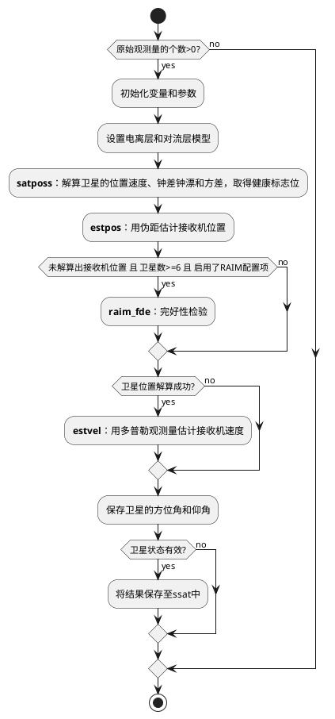
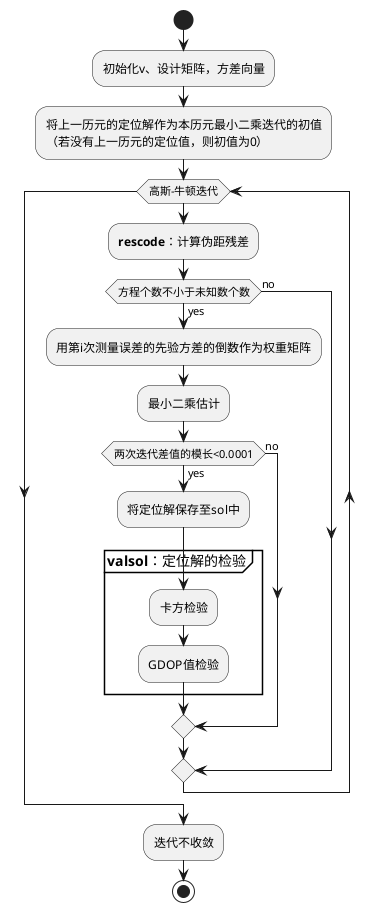
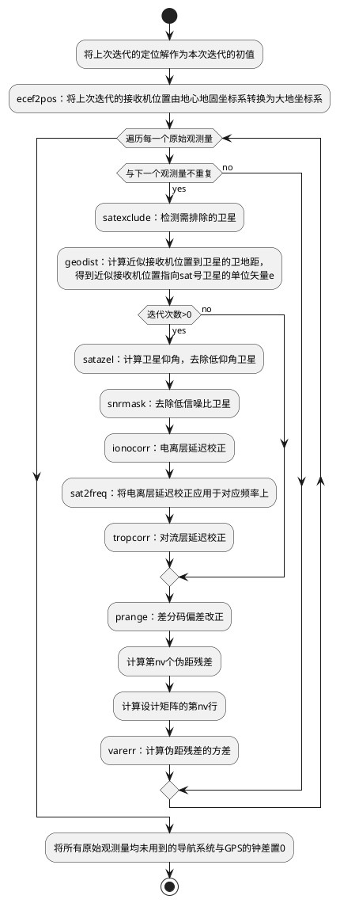

# 单点定位函数 pntpos() 解算流程

## 卫星的位置速度、钟差钟漂、方差解算函数 satposs() 流程

见 [satposs.md](satposs.md#卫星的位置速度钟差钟漂方差解算函数-satposs-流程)

## 位置估计函数 estpos() 解算流程

单点定位解算函数 pntpos 的关键步骤在函数 **estpos** 中，而函数 estpos 调用函数 **rescode** 进行残差的计算。速度估计函数 estvel 的原理与位置估计函数 estpos 类似。

### 伪距残差解算函数 rescode() 流程

