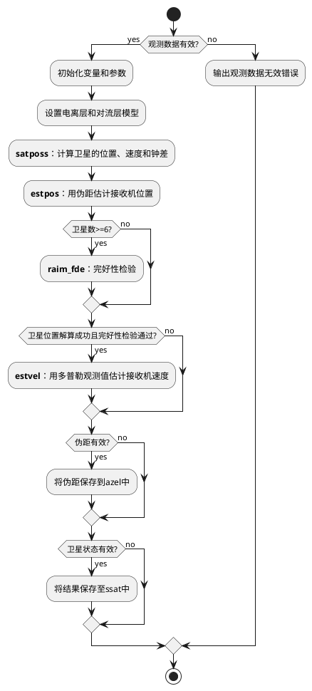
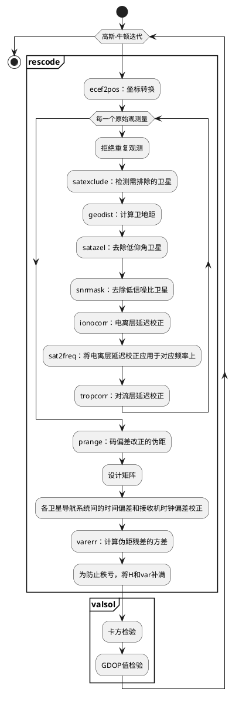

# 单点定位函数 pntpos() 解算流程

## 位置估计函数 estpos() 解算流程

单点定位解算函数 pntpos 的关键步骤在函数 **estpos** 中，而函数 estpos 调用函数 **rescode** 进行残差的计算。速度估计函数 estvel 的原理与位置估计函数 estpos 类似。

### 设计矩阵

单点定位的设计矩阵及其偏导阵如下所示：

$$
h(x)=
    \left[
        \begin{matrix}
            \rho^1_r+cdt_r-cdT^1+I^m_r+T^1_r\\
            \rho^2_r+cdt_r-cdT^2+I^m_r+T^2_r\\
            \rho^3_r+cdt_r-cdT^3+I^m_r+T^3_r\\
            \vdots\\
            \rho^m_r+cdt_r-cdT^m+I^m_r+T^m_r\\
        \end{matrix}
    \right]
H =
    \left[
        \begin{matrix}
            -e_r^{1T} & 1\\
            -e_r^{2T} & 1\\
            -e_r^{3T} & 1\\
            \vdots & \vdots\\
            -e_r^{mT} & 1\\
        \end{matrix}
    \right]
$$

### geodist()

接收机天线的相位中心和卫星天线的相位中心的几何距离：

$$\rho^s_r=||\pmb U(t_r)\pmb r_r(t_r)-\pmb U(t^s)\pmb r^s(t^s)||$$(E.3.8)

其中，$\pmb U(t)$是在t时刻地心地固坐标系(ECEF)到地心惯性坐标系(ECI)的坐标变换矩阵。对于地心地固坐标系中的表达式，必须将地球自转效应纳入其中才能获得几何距离。该公式可以通过以下方程之一进行近似，在1mm水平下具有足够的精度。当前版本的RTKLIB始终使用式(E.3.8b)作为几何距离。(E.3.8b)中的最后一项称为萨格纳克效应。

$$\rho^s_r\approx||\pmb r_r(t_r)-\pmb r^s(t^s)||+\frac{\omega_e}{c}(x^sy_r-y^sx_r)$$(E.3.8b)

接收机到卫星方向上的单位矢量可以用地心地固坐标表示为：

$$\pmb e^s_r=\frac{\pmb r^s(t^s)-\pmb r_r(t_r)}{||\pmb r^s(t^s)-\pmb r_r(t_r)||}$$(E.3.9)

在上式中，地球自转效应被忽略。

### satazel()

$$\pmb e^s_{r,enu}=\pmb E_r\pmb e^s_r=(e_e, e_n, e_u)^T$$(E.3.10)

$$Az^s_r=ATAN2(e_e, e_n)$$(E.3.11)

$$El^s_r=\arcsin(e_u)$$(E.3.12)

### ecef2enu()

$$\pmb E_r=
    \left(
        \begin{matrix}
            -\sin\lambda_r & \cos\lambda_r & 0\\
            -\sin\phi_r\cos\lambda_r & -\sin\phi_r\sin\lambda_r & \cos\phi_r\\
            \cos\phi_r\cos\lambda_r & \cos\phi_r\sin\lambda_r & \sin\phi_r
        \end{matrix}
    \right)
$$(E.2.10)

$$\pmb r_{local}=\pmb E_r(\pmb r_{ECEF}-\pmb r_r)$$(E.2.11)

### ionmodel()

计算L1频率GNSS信号的广播电离层模型：

$$\pmb p_{ion}=\left(\alpha_{0}, \alpha_{1}, \alpha_{2}, \alpha_{3}, \beta_{0}, \beta_{1}, \beta_{2}, \beta_{3}\right)^{T}$$(E.5.5)

$$\psi=0.0137 /(E l+0.11)-0.022$$(E.5.6)

$$\varphi_{i}=\varphi+\psi \cos A z $$(E.5.7)

$$\lambda_{i}=\lambda+\psi \sin A z / \cos \varphi_{i} $$(E.5.8)

$$\varphi_{m}=\varphi_{i}+0.064 \cos \left(\lambda_{i}-1.617\right) $$(E.5.9)

$$t=4.32 \times 10^{4} \lambda_{i}+t $$(E.5.10)

$$F=1.0+16.0 \times(0.53-E l)^{3} $$(E.5.11)

$$x=2 \pi(t-50400) / \sum_{n=0}^{3} \beta_{n} \varphi_{m}{ }^{n} $$(E.5.12)

$$I_{r}^{s}=
\left\{
    \begin{array}{cc}
        F \times 5 \times 10^{-9} & (|x|>1.57) \\
        F \times\left(5 \times 10^{-9}+\sum_{n=1}^{4} \alpha_{n} \varphi_{m}{ }^{n} \times\left(1-\frac{x^{2}}{2}+\frac{x^{4}}{24}\right)\right) & (|x| \leq 1.57)
    \end{array}
\right.$$(E.5.13)

### tropmodel()

标准大气层可以表示为：

$$p=1013.25\times(1-2.2557\times10^{-5}h)^{5.2568}$$(E.5.1)

$$T=15.0-6.5\times10^{-3}h+273.15$$(E.5.2)

$$e=6.108\times\exp\left\{\frac{17.15T-4684.0}{T-38.45}\right\}\times\frac{h_{rel}}{100}$$(E.5.3)

Saastamoinen模型：

$$z=\pi/2-El^s_r$$(E.5.14)

$$T^s_r=\frac{0.002277}{\cos z}\left\{p+\left(\frac{1255}{T}+0.05\right)e-\tan^2z\right\}$$(E.5.4)

### valsol()

$$\pmb v=(v_1,v_2,v_3,\dots,v_m)^T$$(E.6.32)

$$\frac{\pmb v^T\pmb v}{m-n-1}<\chi^2_\alpha(m-n-1)$$(E.6.33)

$$GDOP<GDOP_{thres}$$(E.6.34)

### lsq()

$$\hat{x}=(\pmb H^T\pmb H)^{-1}\pmb H^Ty$$(E.6.6)