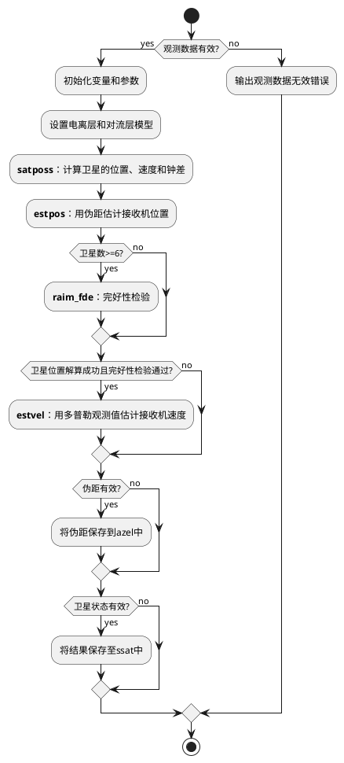
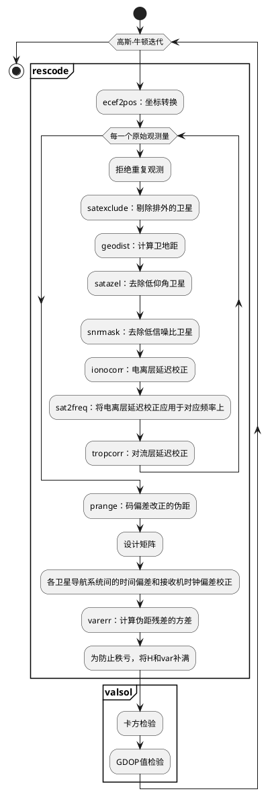

# rtklib 单点定位函数 pntpos() 解算流程

## 参数列表

```c
const obsd_t *obs;   /* I   observation data 原始观测量           */
      int    n;      /* I   number of observation data 卫星个数   */
const nav_t  *nav;   /* I   navigation data 导航电文              */
const prcopt_t *opt; /* I   processing options 处理选项           */
      sol_t  *sol;   /* IO  solution 定位解                       */
      double *azel;  /* IO  azimuth/elevation angle (rad) (NULL: no output) 卫星方位角和仰角 */
      ssat_t *ssat;  /* IO  satellite status              (NULL: no output) 卫星状态        */
      char   *msg;   /* O   error message for error exit 错误信息 */
```

## 数据结构

```c
double *rs   =mat(6,n);   /* 卫星的位置和速度   */
double *dts  =mat(2,n);   /* 卫星和接收机钟差   */
double *var  =mat(1,n);   /* 卫星位置的方差     */
double *azel_=zeros(2,n); /* 卫星的方位角和仰角 */
double *resp =mat(1,n);   /* 伪距残差          */
```

## pntpos()

```c
/* single-point positioning 通过伪距和多普勒观测量计算接收机的位置、速度和钟差-------
* compute receiver position, velocity, clock bias by single-point positioning
* with pseudorange and doppler observables
* return : status(1:ok,0:error)
*-----------------------------------------------------------------------------*/
extern int pntpos(const obsd_t *obs, int n, const nav_t *nav,
                  const prcopt_t *opt, sol_t *sol, double *azel, ssat_t *ssat,
                  char *msg)
{
    prcopt_t opt_=*opt;
    double *rs,*dts,*var,*azel_,*resp;
    int i,stat,vsat[MAXOBS]={0},svh[MAXOBS];
    
    trace(3,"pntpos  : tobs=%s n=%d\n",time_str(obs[0].time,3),n);
    
    sol->stat=SOLQ_NONE;
    // 检验原始观测量的个数是否大于0
    if (n<=0) {
        strcpy(msg,"no observation data");
        return 0;
    }
    sol->time=obs[0].time;
    msg[0]='\0';
    
    rs=mat(6,n); dts=mat(2,n); var=mat(1,n); azel_=zeros(2,n); resp=mat(1,n);
    
    if (opt_.mode!=PMODE_SINGLE) { /* for precise positioning */
        opt_.ionoopt=IONOOPT_BRDC; // 电离层矫正选Klobuchar广播星历模型
        opt_.tropopt=TROPOPT_SAAS; // 对流层矫正选Saastmoinen模型
    }
    /* satellite positons, velocities and clocks 计算卫星的位置、速度和钟差 */
    satposs(sol->time,obs,n,nav,opt_.sateph,rs,dts,var,svh);
    
    /* estimate receiver position with pseudorange 用伪距估计接收机位置 */
    stat=estpos(obs,n,rs,dts,var,svh,nav,&opt_,sol,azel_,vsat,resp,msg);
    
    /* RAIM FDE 完好性检验 */
    if (!stat&&n>=6&&opt->posopt[4]) {
        stat=raim_fde(obs,n,rs,dts,var,svh,nav,&opt_,sol,azel_,vsat,resp,msg);
    }
    /* estimate receiver velocity with Doppler 用多普勒观测量估计接收机速度 */
    if (stat) {
        estvel(obs,n,rs,dts,nav,&opt_,sol,azel_,vsat);
    }
    if (azel) {
        for (i=0;i<n*2;i++) azel[i]=azel_[i];
    }
    if (ssat) {
        for (i=0;i<MAXSAT;i++) {
            ssat[i].vs=0;
            ssat[i].azel[0]=ssat[i].azel[1]=0.0;
            ssat[i].resp[0]=ssat[i].resc[0]=0.0;
            ssat[i].snr[0]=0;
        }
        for (i=0;i<n;i++) {
            ssat[obs[i].sat-1].azel[0]=azel_[  i*2];
            ssat[obs[i].sat-1].azel[1]=azel_[1+i*2];
            ssat[obs[i].sat-1].snr[0]=obs[i].SNR[0];
            if (!vsat[i]) continue;
            ssat[obs[i].sat-1].vs=1;
            ssat[obs[i].sat-1].resp[0]=resp[i];
        }
    }
    free(rs); free(dts); free(var); free(azel_); free(resp);
    return stat;
}
```

## 解算流程



### estpos()

```c
/* estimate receiver position 用伪距估计接收机位置------------------------------*/
static int estpos(const obsd_t *obs, int n, const double *rs, const double *dts,
                  // 原始观测量，原始观测量的个数，卫星的位置和速度，卫星的钟差和钟漂
                  const double *vare, const int *svh, const nav_t *nav,
                  // 卫星位置的方差，卫星的健康标志位，导航点位
                  const prcopt_t *opt, sol_t *sol, double *azel, int *vsat,
                  // 处理选项，定位解，卫星的方位角和仰角，卫星在定位时是否有效
                  double *resp, char *msg)
                  // 伪距残差，错误信息
{
    double x[NX]={0},dx[NX],Q[NX*NX],*v,*H,*var,sig;
    int i,j,k,info,stat,nv,ns;
    
    trace(3,"estpos  : n=%d\n",n);
    
    v=mat(n+4,1); H=mat(NX,n+4); var=mat(n+4,1);
    // 将上一历元的定位值作为本次历元最小二乘迭代的初始值（若没有上一历元的定位值，则初始值为0）
    for (i=0;i<3;i++) x[i]=sol->rr[i];
    // 最小二乘迭代
    for (i=0;i<MAXITR;i++) {
        
        /* pseudorange residuals (m) 计算伪距残差 */
        nv=rescode(i,obs,n,rs,dts,vare,svh,nav,x,opt,v,H,var,azel,vsat,resp,
                   &ns);
        // 方程个数须大于未知数个数
        if (nv<NX) {
            sprintf(msg,"lack of valid sats ns=%d",nv);
            break;
        }
        /* weighted by Std */
        for (j=0;j<nv;j++) {
            sig=sqrt(var[j]);
            v[j]/=sig;
            for (k=0;k<NX;k++) H[k+j*NX]/=sig;
        }
        /* least square estimation */
        if ((info=lsq(H,v,NX,nv,dx,Q))) {
            sprintf(msg,"lsq error info=%d",info);
            break;
        }
        for (j=0;j<NX;j++) {
            x[j]+=dx[j];
        }
        if (norm(dx,NX)<1E-4) {
            sol->type=0;
            sol->time=timeadd(obs[0].time,-x[3]/CLIGHT);
            sol->dtr[0]=x[3]/CLIGHT; /* receiver clock bias (s) */
            sol->dtr[1]=x[4]/CLIGHT; /* GLO-GPS time offset (s) */
            sol->dtr[2]=x[5]/CLIGHT; /* GAL-GPS time offset (s) */
            sol->dtr[3]=x[6]/CLIGHT; /* BDS-GPS time offset (s) */
            sol->dtr[4]=x[7]/CLIGHT; /* IRN-GPS time offset (s) */
            for (j=0;j<6;j++) sol->rr[j]=j<3?x[j]:0.0;
            for (j=0;j<3;j++) sol->qr[j]=(float)Q[j+j*NX];
            sol->qr[3]=(float)Q[1];    /* cov xy */
            sol->qr[4]=(float)Q[2+NX]; /* cov yz */
            sol->qr[5]=(float)Q[2];    /* cov zx */
            sol->ns=(uint8_t)ns;
            sol->age=sol->ratio=0.0;
            
            /* validate solution */
            if ((stat=valsol(azel,vsat,n,opt,v,nv,NX,msg))) {
                sol->stat=opt->sateph==EPHOPT_SBAS?SOLQ_SBAS:SOLQ_SINGLE;
            }
            free(v); free(H); free(var);
            return stat;
        }
    }
    if (i>=MAXITR) sprintf(msg,"iteration divergent i=%d",i);
    
    free(v); free(H); free(var);
    return 0;
}
```

#### 解算流程



### rescode()

```c
/* pseudorange residuals 计算伪距残差----------------------------------------*/
static int rescode(int iter, const obsd_t *obs, int n, const double *rs,
                   // 迭代次数，原始观测量，原始观测量的个数，卫星的位置和速度
                   const double *dts, const double *vare, const int *svh,
                   // 卫星的钟差和钟漂，卫星位置的方差，卫星的健康标志位
                   const nav_t *nav, const double *x, const prcopt_t *opt,
                   // 导航电文，上次迭代的定位值，处理选项
                   double *v, double *H, double *var, double *azel, int *vsat,
                   // 伪距残差，设计矩阵，方差，卫星的方位角和仰角，卫星在定位时是否有效
                   double *resp, int *ns)
                   // 伪距残差，有效卫星的个数（参与定位的卫星的个数）
{
    gtime_t time;
    double r,freq,dion,dtrp,vmeas,vion,vtrp,rr[3],pos[3],dtr,e[3],P;
    int i,j,nv=0,sat,sys,mask[NX-3]={0};
    
    trace(3,"resprng : n=%d\n",n);
    
    for (i=0;i<3;i++) rr[i]=x[i];
    dtr=x[3];
    // 将上次迭代的接收机位置由地心地固坐标系转换为大地坐标系
    ecef2pos(rr,pos);
    // 遍历每个原始观测量
    for (i=*ns=0;i<n&&i<MAXOBS;i++) {
        vsat[i]=0; azel[i*2]=azel[1+i*2]=resp[i]=0.0;
        time=obs[i].time;
        sat=obs[i].sat;
        if (!(sys=satsys(sat,NULL))) continue;
        
        /* reject duplicated observation data 若和下一个观测量重复，跳到下一个观测量 */
        if (i<n-1&&i<MAXOBS-1&&sat==obs[i+1].sat) {
            trace(2,"duplicated obs data %s sat=%d\n",time_str(time,3),sat);
            i++;
            continue;
        }
        /* excluded satellite? 剔除排外的卫星 */
        if (satexclude(sat,vare[i],svh[i],opt)) continue;
        
        /* geometric distance 计算接收机和卫星的卫地距 */
        if ((r=geodist(rs+i*6,rr,e))<=0.0) continue;
        
        if (iter>0) {
            /* test elevation mask 计算卫星仰角，去除低仰角的卫星 */
            if (satazel(pos,e,azel+i*2)<opt->elmin) continue;
            
            /* test SNR mask 去除低信噪比的卫星 */
            if (!snrmask(obs+i,azel+i*2,opt)) continue;
            
            /* ionospheric correction 电离层延迟改正 */
            if (!ionocorr(time,nav,sat,pos,azel+i*2,opt->ionoopt,&dion,&vion)) {
                continue;
            }
            if ((freq=sat2freq(sat,obs[i].code[0],nav))==0.0) continue;
            dion*=SQR(FREQ1/freq);
            vion*=SQR(FREQ1/freq);
            
            /* tropospheric correction 对流层延迟改正 */
            if (!tropcorr(time,nav,pos,azel+i*2,opt->tropopt,&dtrp,&vtrp)) {
                continue;
            }
        }
        /* psendorange with code bias correction 差分码偏差改正 */
        if ((P=prange(obs+i,nav,opt,&vmeas))==0.0) continue;
        
        /* pseudorange residual 伪距残差 */
        v[nv]=P-(r+dtr-CLIGHT*dts[i*2]+dion+dtrp);
        
        /* design matrix 设计矩阵 */
        for (j=0;j<NX;j++) {
            H[j+nv*NX]=j<3?-e[j]:(j==3?1.0:0.0);
        }
        /* time system offset and receiver bias correction 各卫星导航系统间的时间偏差和接收机时钟偏差校正 */
        if      (sys==SYS_GLO) {v[nv]-=x[4]; H[4+nv*NX]=1.0; mask[1]=1;}
        else if (sys==SYS_GAL) {v[nv]-=x[5]; H[5+nv*NX]=1.0; mask[2]=1;}
        else if (sys==SYS_CMP) {v[nv]-=x[6]; H[6+nv*NX]=1.0; mask[3]=1;}
        else if (sys==SYS_IRN) {v[nv]-=x[7]; H[7+nv*NX]=1.0; mask[4]=1;}
#if 0 /* enable QZS-GPS time offset estimation */
        else if (sys==SYS_QZS) {v[nv]-=x[8]; H[8+nv*NX]=1.0; mask[5]=1;}
#endif
        else mask[0]=1;
        
        vsat[i]=1; resp[i]=v[nv]; (*ns)++;
        
        /* variance of pseudorange error 计算伪距残差的方差 */
        var[nv++]=varerr(opt,azel[1+i*2],sys)+vare[i]+vmeas+vion+vtrp;
        
        trace(4,"sat=%2d azel=%5.1f %4.1f res=%7.3f sig=%5.3f\n",obs[i].sat,
              azel[i*2]*R2D,azel[1+i*2]*R2D,resp[i],sqrt(var[nv-1]));
    }
    /* constraint to avoid rank-deficient 为防止秩亏，将H和var补满 */
    for (i=0;i<NX-3;i++) {
        if (mask[i]) continue;
        v[nv]=0.0;
        for (j=0;j<NX;j++) H[j+nv*NX]=j==i+3?1.0:0.0;
        var[nv++]=0.01;
    }
    return nv;
}
```

#### 设计矩阵

单点定位的设计矩阵及其偏导阵如下所示：

$$
h(x)=
    \left[
        \begin{matrix}
            \rho^1_r+cdt_r-cdT^1+I^m_r+T^1_r\\
            \rho^2_r+cdt_r-cdT^2+I^m_r+T^2_r\\
            \rho^3_r+cdt_r-cdT^3+I^m_r+T^3_r\\
            \vdots\\
            \rho^m_r+cdt_r-cdT^m+I^m_r+T^m_r\\
        \end{matrix}
    \right]
H =
    \left[
        \begin{matrix}
            -e_r^{1T} & 1\\
            -e_r^{2T} & 1\\
            -e_r^{3T} & 1\\
            \vdots & \vdots\\
            -e_r^{mT} & 1\\
        \end{matrix}
    \right]
$$

### ecef2pos()

$$r=\sqrt{x^2+y^2}$$(E.2.4)

$$\phi_{r,0}=0$$(E.2.5)

$$\phi_{r,i+1}=\arctan(\frac{z}{r}-\frac{ae^2\tan\phi_{r,i}}{r\sqrt{1+(1-e^2)\tan^2\phi_{r,i}}})$$(E.2.6)

$$\phi_r=\lim_{i\rightarrow\infty}\phi_{r,i}$$(E.2.7)

$$\lambda=ATAN2(y,x)$$(E.2.8)

$$h=\frac{r}{\cos\phi_r}-\frac{a}{\sqrt{(1-e^2)\sin^2\phi_r}}$$(E.2.9)

```c
/* transform ecef to geodetic postion 将地心地固坐标转换为大地坐标系坐标----------
* transform ecef position to geodetic position
* args   : double *r        I   ecef position {x,y,z} (m)
*          double *pos      O   geodetic position {lat,lon,h} (rad,m)
* return : none
* notes  : WGS84, ellipsoidal height
*-----------------------------------------------------------------------------*/
extern void ecef2pos(const double *r, double *pos)
{
    double e2=FE_WGS84*(2.0-FE_WGS84),z,zk,v=RE_WGS84,sinp;
    double r2=dot(r,r,2); // (E.2.4)
    
    for (z=r[2],zk=0.0;fabs(z-zk)>=1E-4;) {
        zk=z;
        sinp=z/sqrt(r2+z*z);
        v=RE_WGS84/sqrt(1.0-e2*sinp*sinp);
        z=r[2]+v*e2*sinp;
    }
    pos[0]=r2>1E-12?atan(z/sqrt(r2)):(r[2]>0.0?PI/2.0:-PI/2.0);
    pos[1]=r2>1E-12?atan2(r[1],r[0]):0.0;
    pos[2]=sqrt(r2+z*z)-v;
}
```

### satexclude()

```c
/* test excluded satellite -----------------------------------------------------
* test excluded satellite
* args   : int    sat       I   satellite number
*          double var       I   variance of ephemeris (m^2)
*          int    svh       I   sv health flag
*          prcopt_t *opt    I   processing options (NULL: not used)
* return : status (1:excluded,0:not excluded)
*-----------------------------------------------------------------------------*/
extern int satexclude(int sat, double var, int svh, const prcopt_t *opt)
{
    int sys=satsys(sat,NULL);
    
    if (svh<0) return 1; /* ephemeris unavailable */
    
    if (opt) {
        if (opt->exsats[sat-1]==1) return 1; /* excluded satellite */
        if (opt->exsats[sat-1]==2) return 0; /* included satellite */
        if (!(sys&opt->navsys)) return 1; /* unselected sat sys */
    }
    if (sys==SYS_QZS) svh&=0xFE; /* mask QZSS LEX health */
    if (svh) {
        trace(3,"unhealthy satellite: sat=%3d svh=%02X\n",sat,svh);
        return 1;
    }
    if (var>MAX_VAR_EPH) {
        trace(3,"invalid ura satellite: sat=%3d ura=%.2f\n",sat,sqrt(var));
        return 1;
    }
    return 0;
}
```

### geodist()

```c
/* geometric distance ----------------------------------------------------------
* compute geometric distance and receiver-to-satellite unit vector
* args   : double *rs       I   satellilte position (ecef at transmission) (m)
*          double *rr       I   receiver position (ecef at reception) (m)
*          double *e        O   line-of-sight vector (ecef)
* return : geometric distance (m) (0>:error/no satellite position)
* notes  : distance includes sagnac effect correction
*-----------------------------------------------------------------------------*/
extern double geodist(const double *rs, const double *rr, double *e)
{
    double r;
    int i;
    
    if (norm(rs,3)<RE_WGS84) return -1.0;
    for (i=0;i<3;i++) e[i]=rs[i]-rr[i];
    r=norm(e,3);
    for (i=0;i<3;i++) e[i]/=r;
    return r+OMGE*(rs[0]*rr[1]-rs[1]*rr[0])/CLIGHT;
}
```

### satazel()

```c
/* satellite azimuth/elevation angle -------------------------------------------
* compute satellite azimuth/elevation angle
* args   : double *pos      I   geodetic position {lat,lon,h} (rad,m)
*          double *e        I   receiver-to-satellilte unit vevtor (ecef)
*          double *azel     IO  azimuth/elevation {az,el} (rad) (NULL: no output)
*                               (0.0<=azel[0]<2*pi,-pi/2<=azel[1]<=pi/2)
* return : elevation angle (rad)
*-----------------------------------------------------------------------------*/
extern double satazel(const double *pos, const double *e, double *azel)
{
    double az=0.0,el=PI/2.0,enu[3];
    
    if (pos[2]>-RE_WGS84) {
        ecef2enu(pos,e,enu);
        az=dot(enu,enu,2)<1E-12?0.0:atan2(enu[0],enu[1]);
        if (az<0.0) az+=2*PI;
        el=asin(enu[2]);
    }
    if (azel) {azel[0]=az; azel[1]=el;}
    return el;
}
```

### snrmask()

```c
/* test SNR mask -------------------------------------------------------------*/
static int snrmask(const obsd_t *obs, const double *azel, const prcopt_t *opt)
{
    if (testsnr(0,0,azel[1],obs->SNR[0]*SNR_UNIT,&opt->snrmask)) {
        return 0;
    }
    if (opt->ionoopt==IONOOPT_IFLC) {
        if (testsnr(0,1,azel[1],obs->SNR[1]*SNR_UNIT,&opt->snrmask)) return 0;
    }
    return 1;
}
```

### ionocorr()

```c
/* ionospheric correction ------------------------------------------------------
* compute ionospheric correction
* args   : gtime_t time     I   time
*          nav_t  *nav      I   navigation data
*          int    sat       I   satellite number
*          double *pos      I   receiver position {lat,lon,h} (rad|m)
*          double *azel     I   azimuth/elevation angle {az,el} (rad)
*          int    ionoopt   I   ionospheric correction option (IONOOPT_???)
*          double *ion      O   ionospheric delay (L1) (m)
*          double *var      O   ionospheric delay (L1) variance (m^2)
* return : status(1:ok,0:error)
*-----------------------------------------------------------------------------*/
extern int ionocorr(gtime_t time, const nav_t *nav, int sat, const double *pos,
                    const double *azel, int ionoopt, double *ion, double *var)
{
    trace(4,"ionocorr: time=%s opt=%d sat=%2d pos=%.3f %.3f azel=%.3f %.3f\n",
          time_str(time,3),ionoopt,sat,pos[0]*R2D,pos[1]*R2D,azel[0]*R2D,
          azel[1]*R2D);
    
    /* GPS broadcast ionosphere model */
    if (ionoopt==IONOOPT_BRDC) {
        *ion=ionmodel(time,nav->ion_gps,pos,azel);
        *var=SQR(*ion*ERR_BRDCI);
        return 1;
    }
    /* SBAS ionosphere model */
    if (ionoopt==IONOOPT_SBAS) {
        return sbsioncorr(time,nav,pos,azel,ion,var);
    }
    /* IONEX TEC model */
    if (ionoopt==IONOOPT_TEC) {
        return iontec(time,nav,pos,azel,1,ion,var);
    }
    /* QZSS broadcast ionosphere model */
    if (ionoopt==IONOOPT_QZS&&norm(nav->ion_qzs,8)>0.0) {
        *ion=ionmodel(time,nav->ion_qzs,pos,azel);
        *var=SQR(*ion*ERR_BRDCI);
        return 1;
    }
    *ion=0.0;
    *var=ionoopt==IONOOPT_OFF?SQR(ERR_ION):0.0;
    return 1;
}
```

### ionmodel()

```c
/* ionosphere model ------------------------------------------------------------
* compute ionospheric delay by broadcast ionosphere model (klobuchar model)
* args   : gtime_t t        I   time (gpst)
*          double *ion      I   iono model parameters {a0,a1,a2,a3,b0,b1,b2,b3}
*          double *pos      I   receiver position {lat,lon,h} (rad,m)
*          double *azel     I   azimuth/elevation angle {az,el} (rad)
* return : ionospheric delay (L1) (m)
*-----------------------------------------------------------------------------*/
extern double ionmodel(gtime_t t, const double *ion, const double *pos,
                       const double *azel)
{
    const double ion_default[]={ /* 2004/1/1 */
        0.1118E-07,-0.7451E-08,-0.5961E-07, 0.1192E-06,
        0.1167E+06,-0.2294E+06,-0.1311E+06, 0.1049E+07
    };
    double tt,f,psi,phi,lam,amp,per,x;
    int week;
    
    if (pos[2]<-1E3||azel[1]<=0) return 0.0;
    if (norm(ion,8)<=0.0) ion=ion_default;
    
    /* earth centered angle (semi-circle) */
    psi=0.0137/(azel[1]/PI+0.11)-0.022;
    
    /* subionospheric latitude/longitude (semi-circle) */
    phi=pos[0]/PI+psi*cos(azel[0]);
    if      (phi> 0.416) phi= 0.416;
    else if (phi<-0.416) phi=-0.416;
    lam=pos[1]/PI+psi*sin(azel[0])/cos(phi*PI);
    
    /* geomagnetic latitude (semi-circle) */
    phi+=0.064*cos((lam-1.617)*PI);
    
    /* local time (s) */
    tt=43200.0*lam+time2gpst(t,&week);
    tt-=floor(tt/86400.0)*86400.0; /* 0<=tt<86400 */
    
    /* slant factor */
    f=1.0+16.0*pow(0.53-azel[1]/PI,3.0);
    
    /* ionospheric delay */
    amp=ion[0]+phi*(ion[1]+phi*(ion[2]+phi*ion[3]));
    per=ion[4]+phi*(ion[5]+phi*(ion[6]+phi*ion[7]));
    amp=amp<    0.0?    0.0:amp;
    per=per<72000.0?72000.0:per;
    x=2.0*PI*(tt-50400.0)/per;
    
    return CLIGHT*f*(fabs(x)<1.57?5E-9+amp*(1.0+x*x*(-0.5+x*x/24.0)):5E-9);
}
```

### sat2freq()

```c
/* satellite and obs code to frequency -----------------------------------------
* convert satellite and obs code to carrier frequency
* args   : int    sat       I   satellite number
*          uint8_t code     I   obs code (CODE_???)
*          nav_t  *nav_t    I   navigation data for GLONASS (NULL: not used)
* return : carrier frequency (Hz) (0.0: error)
*-----------------------------------------------------------------------------*/
extern double sat2freq(int sat, uint8_t code, const nav_t *nav)
{
    int i,fcn=0,sys,prn;
    
    sys=satsys(sat,&prn);
    
    if (sys==SYS_GLO) {
        if (!nav) return 0.0;
        for (i=0;i<nav->ng;i++) {
            if (nav->geph[i].sat==sat) break;
        }
        if (i<nav->ng) {
            fcn=nav->geph[i].frq;
        }
        else if (nav->glo_fcn[prn-1]>0) {
            fcn=nav->glo_fcn[prn-1]-8;
        }
        else return 0.0;
    }
    return code2freq(sys,code,fcn);
}
```

### tropcorr()

```c
/* tropospheric correction -----------------------------------------------------
* compute tropospheric correction
* args   : gtime_t time     I   time
*          nav_t  *nav      I   navigation data
*          double *pos      I   receiver position {lat,lon,h} (rad|m)
*          double *azel     I   azimuth/elevation angle {az,el} (rad)
*          int    tropopt   I   tropospheric correction option (TROPOPT_???)
*          double *trp      O   tropospheric delay (m)
*          double *var      O   tropospheric delay variance (m^2)
* return : status(1:ok,0:error)
*-----------------------------------------------------------------------------*/
extern int tropcorr(gtime_t time, const nav_t *nav, const double *pos,
                    const double *azel, int tropopt, double *trp, double *var)
{
    trace(4,"tropcorr: time=%s opt=%d pos=%.3f %.3f azel=%.3f %.3f\n",
          time_str(time,3),tropopt,pos[0]*R2D,pos[1]*R2D,azel[0]*R2D,
          azel[1]*R2D);
    
    /* Saastamoinen model */
    if (tropopt==TROPOPT_SAAS||tropopt==TROPOPT_EST||tropopt==TROPOPT_ESTG) {
        *trp=tropmodel(time,pos,azel,REL_HUMI);
        *var=SQR(ERR_SAAS/(sin(azel[1])+0.1));
        return 1;
    }
    /* SBAS (MOPS) troposphere model */
    if (tropopt==TROPOPT_SBAS) {
        *trp=sbstropcorr(time,pos,azel,var);
        return 1;
    }
    /* no correction */
    *trp=0.0;
    *var=tropopt==TROPOPT_OFF?SQR(ERR_TROP):0.0;
    return 1;
}
```

### prange()

```c
/* psendorange with code bias correction -------------------------------------*/
static double prange(const obsd_t *obs, const nav_t *nav, const prcopt_t *opt,
                     double *var)
{
    double P1,P2,gamma,b1,b2;
    int sat,sys;
    
    sat=obs->sat;
    sys=satsys(sat,NULL);
    P1=obs->P[0];
    P2=obs->P[1];
    *var=0.0;
    
    if (P1==0.0||(opt->ionoopt==IONOOPT_IFLC&&P2==0.0)) return 0.0;
    
    /* P1-C1,P2-C2 DCB correction */
    if (sys==SYS_GPS||sys==SYS_GLO) {
        if (obs->code[0]==CODE_L1C) P1+=nav->cbias[sat-1][1]; /* C1->P1 */
        if (obs->code[1]==CODE_L2C) P2+=nav->cbias[sat-1][2]; /* C2->P2 */
    }
    if (opt->ionoopt==IONOOPT_IFLC) { /* dual-frequency */
        
        if (sys==SYS_GPS||sys==SYS_QZS) { /* L1-L2,G1-G2 */
            gamma=SQR(FREQ1/FREQ2);
            return (P2-gamma*P1)/(1.0-gamma);
        }
        else if (sys==SYS_GLO) { /* G1-G2 */
            gamma=SQR(FREQ1_GLO/FREQ2_GLO);
            return (P2-gamma*P1)/(1.0-gamma);
        }
        else if (sys==SYS_GAL) { /* E1-E5b */
            gamma=SQR(FREQ1/FREQ7);
            if (getseleph(SYS_GAL)) { /* F/NAV */
                P2-=gettgd(sat,nav,0)-gettgd(sat,nav,1); /* BGD_E5aE5b */
            }
            return (P2-gamma*P1)/(1.0-gamma);
        }
        else if (sys==SYS_CMP) { /* B1-B2 */
            gamma=SQR(((obs->code[0]==CODE_L2I)?FREQ1_CMP:FREQ1)/FREQ2_CMP);
            if      (obs->code[0]==CODE_L2I) b1=gettgd(sat,nav,0); /* TGD_B1I */
            else if (obs->code[0]==CODE_L1P) b1=gettgd(sat,nav,2); /* TGD_B1Cp */
            else b1=gettgd(sat,nav,2)+gettgd(sat,nav,4); /* TGD_B1Cp+ISC_B1Cd */
            b2=gettgd(sat,nav,1); /* TGD_B2I/B2bI (m) */
            return ((P2-gamma*P1)-(b2-gamma*b1))/(1.0-gamma);
        }
        else if (sys==SYS_IRN) { /* L5-S */
            gamma=SQR(FREQ5/FREQ9);
            return (P2-gamma*P1)/(1.0-gamma);
        }
    }
    else { /* single-freq (L1/E1/B1) */
        *var=SQR(ERR_CBIAS);
        
        if (sys==SYS_GPS||sys==SYS_QZS) { /* L1 */
            b1=gettgd(sat,nav,0); /* TGD (m) */
            return P1-b1;
        }
        else if (sys==SYS_GLO) { /* G1 */
            gamma=SQR(FREQ1_GLO/FREQ2_GLO);
            b1=gettgd(sat,nav,0); /* -dtaun (m) */
            return P1-b1/(gamma-1.0);
        }
        else if (sys==SYS_GAL) { /* E1 */
            if (getseleph(SYS_GAL)) b1=gettgd(sat,nav,0); /* BGD_E1E5a */
            else                    b1=gettgd(sat,nav,1); /* BGD_E1E5b */
            return P1-b1;
        }
        else if (sys==SYS_CMP) { /* B1I/B1Cp/B1Cd */
            if      (obs->code[0]==CODE_L2I) b1=gettgd(sat,nav,0); /* TGD_B1I */
            else if (obs->code[0]==CODE_L1P) b1=gettgd(sat,nav,2); /* TGD_B1Cp */
            else b1=gettgd(sat,nav,2)+gettgd(sat,nav,4); /* TGD_B1Cp+ISC_B1Cd */
            return P1-b1;
        }
        else if (sys==SYS_IRN) { /* L5 */
            gamma=SQR(FREQ9/FREQ5);
            b1=gettgd(sat,nav,0); /* TGD (m) */
            return P1-gamma*b1;
        }
    }
    return P1;
}
```

### valsol()

```c
/* validate solution ---------------------------------------------------------*/
static int valsol(const double *azel, const int *vsat, int n,
                  const prcopt_t *opt, const double *v, int nv, int nx,
                  char *msg)
{
    double azels[MAXOBS*2],dop[4],vv;
    int i,ns;
    
    trace(3,"valsol  : n=%d nv=%d\n",n,nv);
    
    /* Chi-square validation of residuals */
    vv=dot(v,v,nv);
    if (nv>nx&&vv>chisqr[nv-nx-1]) {
        sprintf(msg,"chi-square error nv=%d vv=%.1f cs=%.1f",nv,vv,chisqr[nv-nx-1]);
        return 0;
    }
    /* large GDOP check */
    for (i=ns=0;i<n;i++) {
        if (!vsat[i]) continue;
        azels[  ns*2]=azel[  i*2];
        azels[1+ns*2]=azel[1+i*2];
        ns++;
    }
    dops(ns,azels,opt->elmin,dop);
    if (dop[0]<=0.0||dop[0]>opt->maxgdop) {
        sprintf(msg,"gdop error nv=%d gdop=%.1f",nv,dop[0]);
        return 0;
    }
    return 1;
}
```

### lsq()

```c
/* least square estimation -----------------------------------------------------
* least square estimation by solving normal equation (x=(A*A')^-1*A*y)
* args   : double *A        I   transpose of (weighted) design matrix (n x m)
*          double *y        I   (weighted) measurements (m x 1)
*          int    n,m       I   number of parameters and measurements (n<=m)
*          double *x        O   estmated parameters (n x 1)
*          double *Q        O   esimated parameters covariance matrix (n x n)
* return : status (0:ok,0>:error)
* notes  : for weighted least square, replace A and y by A*w and w*y (w=W^(1/2))
*          matirix stored by column-major order (fortran convention)
*-----------------------------------------------------------------------------*/
extern int lsq(const double *A, const double *y, int n, int m, double *x,
               double *Q)
{
    double *Ay;
    int info;
    
    if (m<n) return -1;
    Ay=mat(n,1);
    matmul("NN",n,1,m,1.0,A,y,0.0,Ay); /* Ay=A*y */
    matmul("NT",n,n,m,1.0,A,A,0.0,Q);  /* Q=A*A' */
    if (!(info=matinv(Q,n))) matmul("NN",n,1,n,1.0,Q,Ay,0.0,x); /* x=Q^-1*Ay */
    free(Ay);
    return info;
}
```